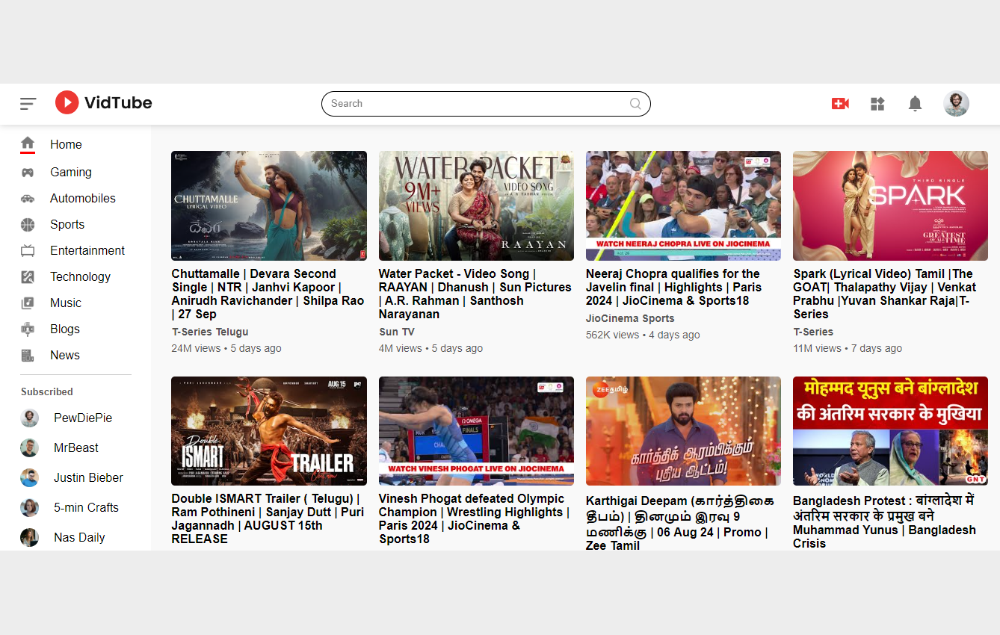

# YouTube Clone

## Table of Contents
- [Project Overview](#project-overview)
- [Features](#features)
- [Technologies Used](#technologies-used)
- [Installation](#installation)
- [Usage](#usage)
- [Screenshots](#screenshots)
- [Contact](#contact)

## Project Overview
The **YouTube Clone** is a React application that mimics the core features of YouTube, allowing users to search for and watch videos. The app is designed to replicate the look and feel of YouTube while providing a streamlined experience for users.

The site is hosted on Vercel and can be accessed at [YouTube Clone](https://youtube-clone-zeta-rose.vercel.app/).

## Features
- **Video Search:** Search for videos by keywords.
- **Video Playback:** Watch videos within the app.
- **Responsive Design:** The app is fully responsive and optimized for various devices.

## Technologies Used
- **React:** Frontend library for building the user interface.
- **Vercel:** Hosting platform for the application.
- **YouTube API:** For fetching video data.

## Installation
To run the YouTube Clone locally, follow these steps:

1. Clone the repository:
    ```bash
    git clone https://github.com/68rajat68/youtube-clone.git
    ```

2. Navigate to the project directory:
    ```bash
    cd youtube-clone
    ```

3. Install the dependencies:
    ```bash
    npm install
    ```

4. Start the development server:
    ```bash
    npm start
    ```

5. Open your browser and go to `http://localhost:3000` to see the app in action.

## Usage
To use the app, visit the <a href="https://youtube-clone-zeta-rose.vercel.app/" target="_blank">YouTube Clone</a>. Search for videos using the search bar, and click on any video to start playback.

## Screenshots
Some screenshots of Youtube Clone.

### Homepage


### Video Playback


## Contact
If you have any questions or suggestions, feel free to contact me at [68rajat68@gmail.com].


